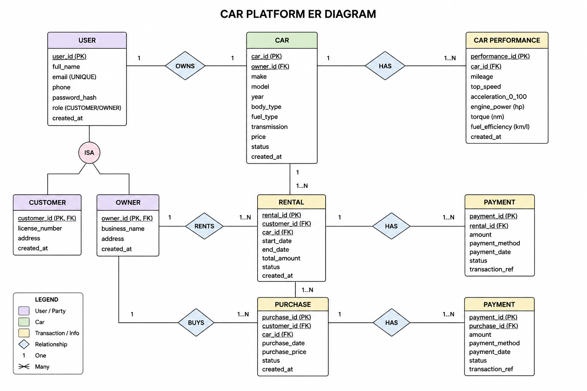
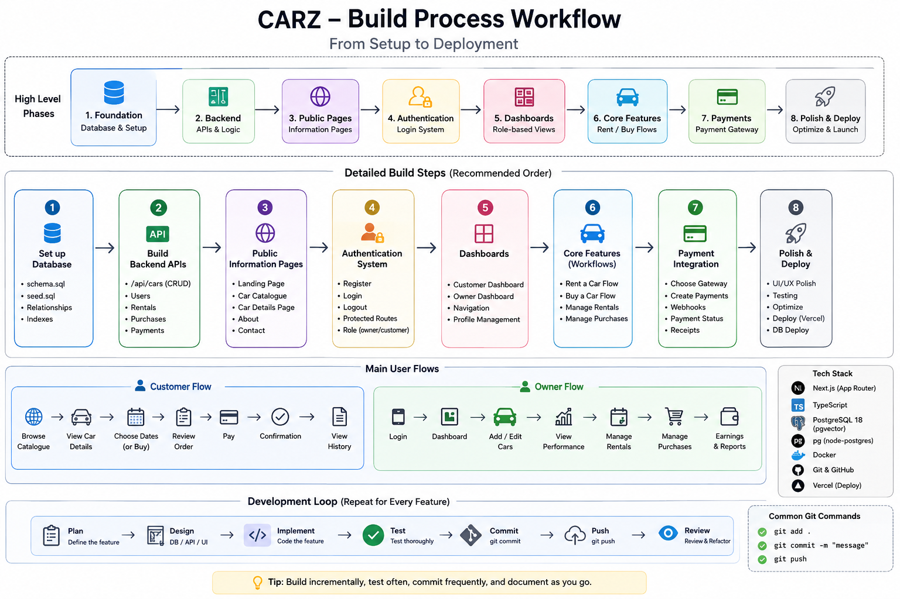

This is a [Next.js](https://nextjs.org) project bootstrapped with [`create-next-app`](https://nextjs.org/docs/app/api-reference/cli/create-next-app).

## Getting Started

First, run the development server:

```bash
npm run dev
# or
yarn dev
# or
pnpm dev
# or
bun dev
```

Open [http://localhost:3000](http://localhost:3000) with your browser to see the result.

You can start editing the page by modifying `app/page.tsx`. The page auto-updates as you edit the file.

This project uses [`next/font`](https://nextjs.org/docs/app/building-your-application/optimizing/fonts) to automatically optimize and load [Geist](https://vercel.com/font), a new font family for Vercel.

## Learn More

To learn more about Next.js, take a look at the following resources:

- [Next.js Documentation](https://nextjs.org/docs) - learn about Next.js features and API.
- [Learn Next.js](https://nextjs.org/learn) - an interactive Next.js tutorial.

You can check out [the Next.js GitHub repository](https://github.com/vercel/next.js) - your feedback and contributions are welcome!

## Deploy on Vercel

The easiest way to deploy your Next.js app is to use the [Vercel Platform](https://vercel.com/new?utm_medium=default-template&filter=next.js&utm_source=create-next-app&utm_campaign=create-next-app-readme) from the creators of Next.js.

Check out our [Next.js deployment documentation](https://nextjs.org/docs/app/building-your-application/deploying) for more details.
# CARZ
A full-stack, multi-role car rental and marketplace system built to simulate a real-world vehicle ecosystem where users can rent or buy cars, owners can manage listings and analytics, and drivers can interact with customers in real time.

## ER DIAGRAM



## Development Workflow

CARZ is developed using a layered, incremental approach where each feature builds upon a stable foundation. The project begins with designing the PostgreSQL database schema, including tables, relationships, constraints, and indexes, followed by setting up the local Docker database and seeding initial data. Once the data layer is complete, the backend APIs are implemented using Next.js Route Handlers to provide CRUD operations and business logic for cars, rentals, purchases, payments, and performance tracking.

With the backend in place, development moves to the frontend by creating public-facing pages such as the landing page, vehicle catalogue, car details, and informational pages (About, Contact, FAQ, etc.). After visitors can browse the platform, authentication and authorization are introduced, allowing users to securely register, log in, and access role-based features as either customers or owners.

The next phase focuses on dashboards and the application's core workflows. Customers can browse vehicles, rent or purchase cars, and review their transaction history, while owners can manage inventory, rentals, purchases, and vehicle performance through dedicated dashboards. Once these business workflows are functioning correctly, a payment gateway is integrated to securely process transactions and update payment statuses.

The final stage consists of refining the user interface, improving responsiveness and accessibility, optimizing performance, adding notifications and email functionality, testing the application thoroughly, and deploying the frontend and PostgreSQL database to production. Throughout development, each feature follows a consistent cycle of planning, implementation, testing, committing to Git, and pushing changes to GitHub, ensuring the project remains organized, maintainable, and easy to extend.

