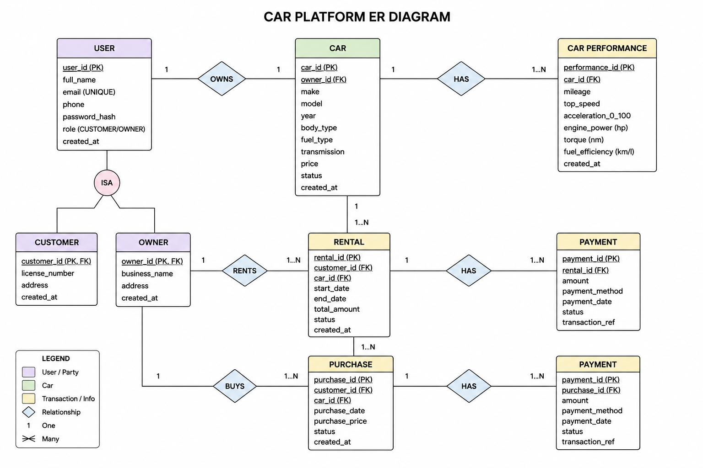
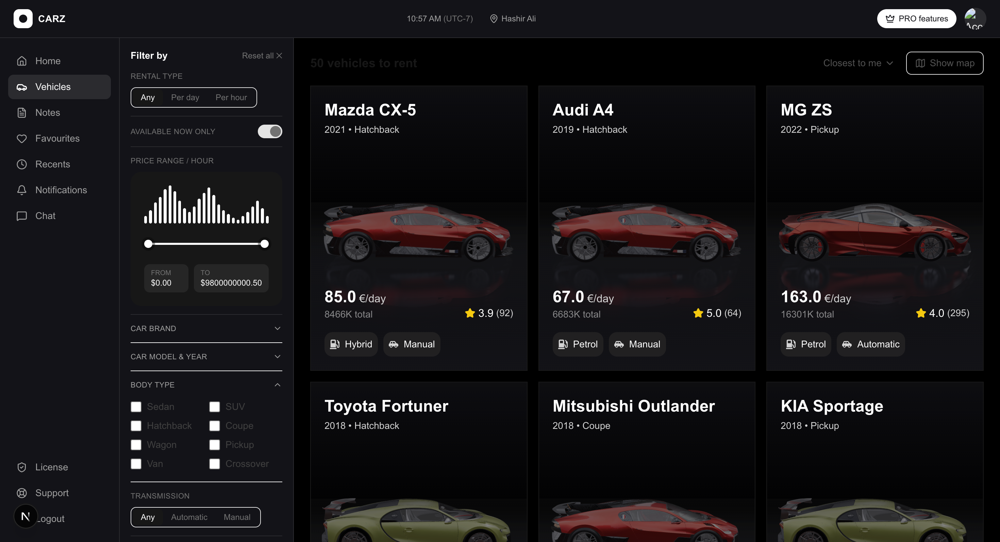
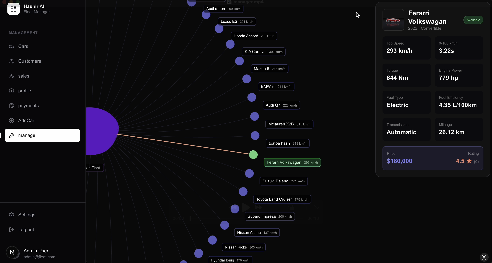
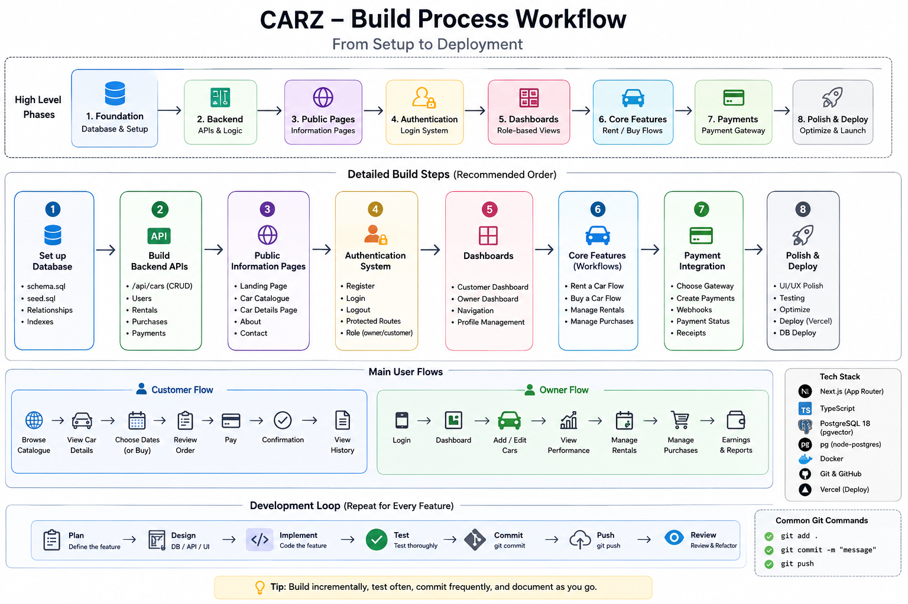

# CARZ 🚗

A full-stack, multi-role car rental and marketplace platform built to simulate a real-world vehicle ecosystem.

CARZ allows customers to browse, rent, and purchase vehicles while enabling owners to manage their inventory, monitor performance, track transactions, and analyze business operations through dedicated dashboards.

The platform combines modern frontend technologies, backend APIs, database architecture, and 3D visualization to create an interactive automotive management experience.

---

## 📑 Table of Contents

- [🚀 Features](#-features)
  - [Customer Features](#customer-features)
  - [Owner Features](#owner-features)
  - [Driver Features](#driver-features)
  - [Platform Features](#platform-features)
- [🛠️ Tech Stack](#️-tech-stack)
  - [Frontend](#frontend)
  - [Backend](#backend)
  - [Database](#database)
  - [Other Tools](#other-tools)
- [📐 ER Diagram](#-er-diagram)
- [🖼️ Application Showcase](#️-application-showcase)
  - [Landing Page](#landing-page)
  - [Owner Management Dashboard](#owner-management-dashboard)
- [🔄 Development Workflow](#-development-workflow)
- [📂 Project Structure](#-project-structure)
- [⚙️ Getting Started](#️-getting-started)
  - [Environment Variables](#environment-variables)
- [▶️ Running the Application](#️-running-the-application)
- [🐳 Running PostgreSQL with Docker](#-running-postgresql-with-docker)
- [📦 Deployment](#-deployment)
- [Carz Rental Service Pipeline](#carz-rental-service-pipeline)
- [🔮 Future Improvements](#-future-improvements)
- [👨‍💻 Author](#-author)

## 🚀 Features

### Customer Features
- Browse available vehicles
- View detailed car information
- Rent vehicles
- Purchase vehicles
- Track rental and purchase history
- Manage customer profile
- Interact with owners/drivers through chat

### Owner Features
- Add, update, and remove vehicle listings
- Manage vehicle inventory
- View rental and purchase activity
- Track vehicle performance
- Monitor revenue and analytics
- Access owner management dashboard

### Driver Features
- Driver profile management
- Customer interaction support
- Rental workflow assistance

### Platform Features
- Role-based authentication and authorization
- PostgreSQL relational database
- REST API architecture
- Real-time communication
- Vehicle performance analytics
- 3D vehicle visualization using Three.js
- Responsive UI design

---

# 🛠️ Tech Stack

## Frontend
- Next.js (App Router)
- React
- TypeScript
- Tailwind CSS
- Three.js
- React Three Fiber
- Framer Motion

## Backend
- Next.js Route Handlers
- Node.js
- REST APIs

## Database
- PostgreSQL
- SQL relational modeling
- Docker database environment

## Other Tools
- Git & GitHub
- Cloud storage for assets
- Docker
- Vercel deployment

---

# 📐 ER Diagram

The database architecture is designed around users, vehicles, rentals, purchases, payments, and performance tracking.



---

# 🖼️ Application Showcase

## Landing Page

The CARZ landing experience provides an interactive introduction to the platform with modern UI elements and 3D vehicle visualization.




## Owner Management Dashboard

The owner dashboard allows vehicle owners to manage listings, track operations, and monitor their automotive business.



---

# 🔄 Development Workflow

CARZ is developed using a layered and incremental development approach where every feature builds upon a stable foundation.

The development process begins with designing the PostgreSQL database schema, including tables, relationships, constraints, and indexes. After establishing the data layer, the database environment is configured using Docker and populated with initial seed data.

The backend layer is then implemented using Next.js Route Handlers to provide APIs for managing vehicles, rentals, purchases, payments, users, and performance metrics.

Once the backend services are stable, frontend development begins with public-facing pages such as:

- Landing page
- Vehicle catalogue
- Vehicle details
- About page
- Contact page
- FAQ pages

Authentication and authorization are introduced afterward, enabling secure access to role-based functionality for customers, owners, and drivers.

The next phase focuses on core application workflows:

### Customers can:
- Browse vehicles
- Rent cars
- Purchase vehicles
- View transaction history

### Owners can:
- Manage inventory
- Track rentals
- Monitor purchases
- Analyze vehicle performance

After completing the main workflows, additional features such as payment integration, notifications, optimization, testing, and production deployment are implemented.

Throughout development, every feature follows a consistent workflow:

1. Planning
2. Database design
3. Backend implementation
4. Frontend integration
5. Testing
6. Git commit
7. Deployment

This approach keeps the project scalable, maintainable, and easy to extend.



---

# 📂 Project Structure

```
CARZ
│
├── app
│   ├── api              # Backend API routes
│   ├── dashboard        # Role-based dashboards
│   ├── cars             # Vehicle pages
│   └── components       # UI components
│
├── Images               # README assets
│
├── database             # SQL schema and seed files
│
├── public               # Static assets
│
├── components           # Reusable React components
│
└── package.json
```

---

# ⚙️ Getting Started

Clone the repository:

```bash
git clone <repository-url>
```

Navigate into the project:

```bash
cd CARZ
```

Install dependencies:

```bash
npm install
```

or

```bash
pnpm install
```

---

## Environment Variables

Create a `.env` file in the root directory:

```env
DATABASE_URL=
NEXT_PUBLIC_API_URL=
AUTH_SECRET=
```

Configure the variables according to your PostgreSQL and deployment environment.

---

# ▶️ Running the Application

Start the development server:

```bash
npm run dev
```

or:

```bash
pnpm dev
```

Open:

```
http://localhost:3000
```

---

# 🐳 Running PostgreSQL with Docker

Start the database container:

```bash
docker compose up
```

Run migrations or initialize the database schema:

```bash
psql < schema.sql
```

---

# 📦 Deployment

CARZ can be deployed using platforms such as:

- Vercel for Next.js frontend
- Managed PostgreSQL providers for production databases

Before deployment:

1. Configure environment variables
2. Run production build

```bash
npm run build
```

3. Start production server

```bash
npm start
```

---

# Carz Rental Service Pipeline

Yes. At this point, **don’t build more UI first**. we already have the beginning of the customer flow:**Showroom → Select Car → Services → Route (From/To) → Rental details**Now we need to turn that into an actual **rental transaction pipeline**.The key idea is: **the route page should calculate the rental, but the backend should be the authority that creates and validates the rental.**

[](https://app.eraser.io/workspace/oeNsvpy7zskBQXdh0JNN?diagram=2PVLJKlwPJSIJfYh3fOO)

Starting by updating the car rentals table, the following is the race condition upon the route : 

what if we do  

"rent" even -> pending

 "pay " even -> rented 

and available by default, that would work but the thing is, that what if there were many people that rented it at the same time who would get it in the end, and if i set it such that if the status is pending, then others cant select the vehicle to solve this,then i would risk losing other clients if the current one decides he wants to go with a different car?

to which I found the following solution :

[](https://app.eraser.io/workspace/oeNsvpy7zskBQXdh0JNN?diagram=XkhDEr8yq-zW1O9-Y8Yt)

Flow Becomes this :

[](https://app.eraser.io/workspace/oeNsvpy7zskBQXdh0JNN?diagram=5e1Iq7We4LJ32AIpK3f0)


# 🔮 Future Improvements

- Online payment gateway integration
- Live vehicle tracking
- AI-based vehicle recommendations
- Advanced analytics dashboard
- Mobile application
- Push notifications
- Automated email workflows

---

# 👨‍💻 Author

Developed as a full-stack software engineering project demonstrating:

- Database architecture
- Backend API development
- Modern frontend engineering
- 3D web experiences
- Role-based application design
